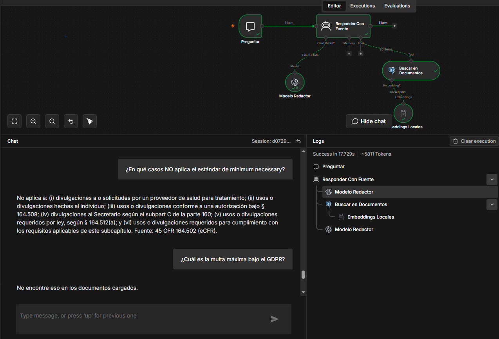

*[English](README.md) · **Español***

# RAG privado — medido, no demostrado

Un sistema de recuperación aumentada por generación que corre entero en mi propio servidor y
responde preguntas sobre normativa de salud de EE. UU. **sin que los documentos salgan nunca de la
máquina**.

Lo que este repo quiere mostrar no es que funciona. Es que **medí qué tan bien funciona, encontré
dónde se rompe, y puedo probar cuál de los arreglos valía la pena** — incluidos los que hice mal.

**Stack:** PostgreSQL 17 + pgvector · Ollama con BGE-M3 (local, solo CPU) · n8n · `gpt-5-mini`
**Servidor:** Hetzner CX33 — 4 vCPU, 8 GB de RAM, sin GPU · ~$9 al mes
**Corpus:** HIPAA, 45 CFR partes 160/162/164 — 148 secciones de la API del eCFR, vigentes al 6 ago 2026

---

## Resultados

20 preguntas con la respuesta verificada a mano contra la fuente. 16 tienen respuesta conocida;
**4 son de control y su respuesta correcta es que el sistema diga que no sabe.**

| | PDF, topK 5 | PDF, topK 20 | **Corpus por secciones** |
|---|---|---|---|
| Completas y correctas (de 16) | 7 | 11 | **12** |
| Fallos (de 16) | 9 | 5 | **4** |
| Falso negativo (se calló teniendo la respuesta) | 0 | **1** | **0** |
| Preguntas de control superadas | **4 / 4** | **4 / 4** | **4 / 4** |
| **Alucinaciones** | **0** | **0** | **0** |
| **Puntaje estricto** | 11/20 — 55% | 15/20 — 75% | **16/20 — 80%** |

**Ese +5 no es un resultado.** Con n=20 el puntaje carga ±18 puntos, y 75→80 es una sola pregunta.
Reportarlo como "mejoró a 80%" sería reportar ruido.

**El resultado es este:**

| Subir el `topK` de 5 a 20 | arregló 4 · **rompió 1** |
| Reestructurar el corpus | arregló 3, más recuperó una pregunta que antes daba timeout · **rompió 0** |

El primer cambio fue un canje. El segundo no. Y esa diferencia solo se ve porque las mismas 20
preguntas corrieron contra los dos.

---

## Qué responde de verdad



Dos preguntas, una sesión, nada montado.

**La primera** pregunta en español en qué casos no aplica el estándar de *minimum necessary*, contra
una norma en inglés. Vuelve con los seis casos y la cita — `45 CFR 164.502` — que es una sección que
cualquiera puede abrir y comprobar.

**La segunda** pregunta por la multa máxima del GDPR. El GDPR no está en este corpus. La respuesta
es la frase exacta de rechazo, y **esa es la mitad que compra una clínica**: un sistema que se calla
es auditable; uno que improvisa es un riesgo legal.

**El panel de la derecha es lo que vale leer dos veces.** Enseña lo que el texto solo puede afirmar:

| `Success in 17.729s` | Latencia real, en 4 vCPU sin GPU |
| `~5811 Tokens` | Lo que cuesta una respuesta |
| `20 items` entrando por la conexión Tool | Los 20 fragmentos que de verdad llegan al modelo |
| `1024 items` en Embeddings | La firma de BGE-M3 — calculados en la misma máquina que los guarda |
| El árbol de ejecución | Buscó **antes** de escribir. Esa es la regla 1 del prompt, cumplida |

---

## La forma

```
INDEXAR — se paga una vez, ~9 min en 4 vCPU sin GPU

  API del eCFR ──→ 148 archivos Markdown ──→ un POST por sección ──→ n8n
   3 llamadas          uno por §              webhook autenticado       │
                                                                        │
                                       partir 1000 / 150 de solape ─────┤
                                    embeddings BGE-M3, en local ────────┤
                                                                        ↓
                                                PostgreSQL + pgvector
                                                653 fragmentos, cada uno con
                                                su §, su cita oficial y la
                                                fecha en que se descargó


PREGUNTAR — mediana 16 s

  pregunta en español ──→ BGE-M3 ──→ 20 fragmentos más cercanos ──→ gpt-5-mini
   contra texto inglés   mismo modelo      desde pgvector             redacta
                         que al indexar                                  │
                                                                         │
                            respuesta + cita verificable ────────────────┤
                     o "No encontré eso en los documentos cargados" ─────┘
```

**Nada cruza la frontera del medio.** El documento se convierte en vectores en la misma máquina que
los guarda; solo los 20 fragmentos recuperados salen del servidor.

---

## Cómo se corre

```bash
docker compose up -d                                  # Postgres + pgvector, Ollama
docker compose exec ollama ollama pull bge-m3         # modelo de embeddings, 1.2 GB

pwsh corpus/descargar-corpus.ps1                      # 3 llamadas a la API → 148 archivos .md
```

Se importan los dos workflows de [`workflows/`](workflows/) en n8n. Cada nodo lleva una nota que
explica qué hace y por qué, y todo campo que haya que cambiar está marcado con `>>> REPLACE`: tres
credenciales (Postgres, Ollama, header auth) y nada más.

```powershell
$env:RAG_N8N   = "https://tu-n8n.ejemplo.com"
$env:RAG_TOKEN = "<el token de header-auth que creaste>"
pwsh corpus/cargar-en-n8n.ps1                         # 148 POST, ~9 min en 4 vCPU
```

Ni Postgres ni Ollama publican puertos. El webhook de carga exige un token de cabecera.

---

## La decisión de arquitectura que importa

**Los embeddings corren en local. Solo los fragmentos recuperados salen del servidor.**

Ese es el argumento entero para una clínica o un laboratorio: el documento nunca se sube a ningún
lado. BGE-M3 lo convierte en vectores en la misma máquina que los guarda.

Una segunda decisión que no cuesta nada y evita una caída: **este stack tiene su propio archivo de
compose**, separado de la instancia de n8n donde corre el bot de un cliente. Bajar el RAG para
mantenimiento no puede dejar a un cliente sin servicio.

---

## El hallazgo que cambió el proyecto

La primera versión indexaba un **PDF**: 115 páginas, 577 fragmentos, cortados cada 1000 caracteres.
Siete de dieciséis respuestas salieron incompletas porque las listas numeradas quedaban partidas
entre fragmentos.

El diagnóstico obvio era "arreglar el chunking". **Era el diagnóstico equivocado.**

La norma la publica el eCFR con una **API pública sin llave**, y devuelve cada sección como un
`<DIV8 TYPE="SECTION">` con su número y su cita oficial como atributos. La estructura que iba a
reconstruir con un regex **estaba en la fuente desde el principio**.

```
3 llamadas a la API  →  148 archivos Markdown, uno por sección  →  653 fragmentos,
                        cada uno con su §, su cita oficial y su fecha de descarga
```

**El cuello de botella nunca fue la estrategia de chunking. Fue elegir mal el formato de entrada.**
Un PDF es una foto del documento; el XML es el documento.

De ahí cayeron dos cosas gratis:

- **La procedencia viaja con cada fragmento** — `section`, `citation`, la URL de `source` y la fecha
  `retrieved`. Eso es lo que hace una respuesta auditable en vez de solo creíble.
- **El corpus está al día.** El PDF tenía enmiendas hasta marzo de 2013. La API informa su propia
  fecha de vigencia, así que el corpus no puede envejecer en silencio.

### Y el corpus sí estaba viejo

El eCFR también expone un **endpoint de versiones**. Al consultarlo por las 17 secciones que
sostienen la evaluación devolvió **33 registros de enmienda, todos posteriores a la fecha del PDF**.
Tres secciones traen enmiendas de 2024 y 2026 — una de hace **poco más de dos meses**.

Verificado a mano: los montos del § 160.404 y los cinco elementos del § 164.404 están sin cambios,
así que esas respuestas siguen valiendo. **El punto no es que las respuestas estuvieran mal: es que
no había forma de saberlo sin comprobarlo**, y una llamada de dos minutos reemplazó una tarde de
re-verificación.

Para un cliente eso no es una nota al pie, es el servicio: **sus documentos también envejecen.**

---

## Lo que encontró la evaluación

**Cero alucinaciones en 20 preguntas, en las tres rondas.** Las cuatro de control respondieron *"No
encontré eso en los documentos cargados"* todas las veces.

**Subir `topK` de 5 a 20 arregló cuatro respuestas y rompió una.** La pregunta 16 pasó de
parcialmente correcta a *"No encontré eso"* — con veinte fragmentos en el contexto, la señal quedó
enterrada.

Ese resultado tiene un nombre que encontré después: **"Lost in the Middle"**. Las guías de
producción lo dicen sin rodeos: *no devuelvas más de 10 documentos sin reranking, o el modelo ignora
lo que queda en el medio del contexto*. Subir el `topK` compró recall y lo pagó con precisión.

**Un error que ningún lector habría detectado.** A la pregunta de a partir de cuántos afectados hay
que avisar a los medios, el sistema respondió *"a partir de 500"* mientras citaba el texto que él
mismo había recuperado: *"more than 500 residents"*. Una brecha que afecte exactamente a 500
personas **no** obliga a avisar a los medios. *(Corregido en el corpus por secciones.)*

**Los fallos de recuperación y los de generación se arreglan al revés** — y ahora se pueden
distinguir, leyendo qué devolvió de verdad el paso de recuperación.

**Dos de los cuatro fallos que quedan son citas equivocadas**, y no son fallos nuevos: son fallos
que antes eran invisibles. Una cita que apunta a un documento de 115 páginas nunca puede estar mal.
Una que apunta a `45 CFR 164.530` sí, y lo está: las salvaguardas de la Security Rule viven en los
§§ 164.308, 164.310 y 164.312.

**Los otros dos son dilución de ranking, y se midió.** Preguntado por la definición de *business
associate*, el sistema devolvió una respuesta a la que le faltaba la cláusula central. Leyendo el
paso de recuperación se ve por qué: **solo 3 de los 20 fragmentos venían del § 160.103**, la sección
que define el término. Los otros 17 salieron de siete secciones que **mencionan** business
associates sin **definirlos**.

El término aparece por toda la norma, así que la búsqueda por significado trajo el tema entero y le
dejó tres puestos de veinte a la única sección que contesta. **Ese es el caso de libro para búsqueda
híbrida y reranking.**

**Dos hipótesis murieron a mitad de ronda.** La primera: *"las preguntas de lista fallan y las de
dato puntual aciertan"* — la mató la P12, cuatro niveles de multas respondidos enteros. La segunda:
*"falla cuando la sección es enorme"* — la mató la P16, perfecta sobre una de las secciones más
grandes. La tercera hipótesis, dilución por popularidad del término, encaja con los veinte casos y
**queda escrita como hipótesis**, a probar con el reranking en vez de anunciarse como conclusión.

**Y el aviso metodológico que pesa más que el puntaje.** La pregunta 14 se corrió dos veces con una
configuración idéntica. La primera devolvió los cinco elementos exigidos **más uno del § 164.410**.
La segunda devolvió los cinco limpios. Nada cambió entre las dos. **El modelo no es determinista**,
así que este 80% carga dos ruidos: el de la muestra y el del propio modelo.

---

## Método: medir antes de construir

Durante este proyecto se propusieron cuatro arreglos caros. **Tres estaban equivocados, y medir es
lo que lo demostró.**

**"Los fragmentos están cortados a mitad de lista — hay que reindexar con otra estrategia."**
Sonaba bien, venía con evidencia, y costaba una tarde entera. Un experimento de un minuto —subir el
`topK`— mostró que los fragmentos que faltaban **sí existían**; solo quedaban por debajo del corte.
El diagnóstico había confundido *"no llegó"* con *"no existe"*.

**"Subir el `chunkSize` de 1000 a 2000."**
El estudio más completo sobre el tema ([Zhou et al., 2026](https://arxiv.org/abs/2602.16974))
concluye que el tamaño del fragmento *"correlaciona débilmente con la efectividad en corpus"*. El
tamaño no es la palanca — **dónde se corta, sí**.

**"Limitar `maxTokens` para controlar la latencia."**
`maxTokens` recorta la salida: trata el síntoma. Para los modelos de la familia GPT-5 el parámetro
que manda es `reasoning_effort` — un ingeniero que corrió
[la evaluación de RAG de Microsoft](https://techcommunity.microsoft.com/blog/azuredevcommunityblog/gpt-5-will-it-rag/4442676)
observó que con `minimal` el modelo nunca gastó tokens de razonamiento y aun así dio respuestas de
calidad, y plantea que responder con RAG quizá no sea una tarea de razonamiento. **Él mismo dice que
no probó la alternativa**, así que es una pista, no un hallazgo — que es exactamente como se debió
citar la primera vez. *(Ver la [auditoría de fuentes](evaluacion/investigacion-chunking.md#source-audit--what-survived-verification-and-what-didnt).)*

**"Escribir un preprocesador que extraiga el § de cada fragmento."**
Dos horas de parseo que sobraron por una pregunta que nadie había hecho: *¿de dónde salió este PDF?*

El patrón: **los fallos que cuestan caro no son los que revientan.** Un parámetro mal puesto se
anuncia solo. Un diagnóstico seguro de sí mismo, no: se lee bien, suena terminado, y te manda a
construir lo equivocado durante media tarde.

### Quién los propuso

Los cuatro arreglos los propuso el asistente de IA con el que se construyó esto, en Claude Code.
Tres estaban mal — y **ninguno lo detectó el propio asistente revisando su trabajo.** Los cuatro
los atajó la misma pregunta humana: *¿esto está verificado o lo estás afirmando de memoria?*

Esa pregunta es el método. La herramienta es reemplazable; el hábito de exigir evidencia antes de
autorizar media tarde de trabajo, no.

---

## Límites conocidos

Van escritos porque un resultado sin sus límites no es un resultado.

- **20 preguntas, así que el puntaje absoluto carga ±18 puntos.** Ninguna guía que encontré pone el
  piso por debajo de 50: [QASkills](https://qaskills.sh/blog/golden-dataset-llm-evaluation-guide)
  dice 50–100 como mínimo viable, [Braintrust](https://www.braintrust.dev/articles/what-is-rag-evaluation)
  50–200, y [Microsoft](https://medium.com/data-science-at-microsoft/the-path-to-a-golden-dataset-or-how-to-evaluate-your-rag-045e23d1f13f)
  *"certainly not less than 100"*. Ni siquiera 50 baja el margen de ±12. La comparación pareada es
  el resultado; el porcentaje es un orden de magnitud.
- **Una sola ejecución por pregunta.** La P14 demostró que el modelo da respuestas distintas ante
  entradas idénticas.
- **653 fragmentos.** Pedir 20 es el 3% de este corpus; contra 100.000 sería el 0.02%. **El arreglo
  del `topK` no escala.**
- **Solo búsqueda vectorial, sin híbrida.** Los embeddings encuentran por significado, no por cadena
  exacta: son débiles buscando un `164.404` literal. En la medición de Anthropic, sumar BM25 bajó el
  fallo de recuperación de 3.7% a 2.9%. Ese número es un techo, no un pronóstico: **ellos usaron
  BM25 y esta máquina no puede** — ver la corrección en *Lo que sigue*.
- **La tabla no tiene índice vectorial** — solo la clave primaria. Cada búsqueda recorre los 653
  fragmentos uno por uno.
- **Dos de los veinte puestos recuperados eran encabezados de sección** — una línea cada uno. Un 10%
  del contexto desperdiciado.
- **El § 160.404 remite a la parte 102 del 45 CFR para los montos ajustados por inflación, y la
  parte 102 no está en el corpus.** La norma se referencia fuera de sus propias partes.

---

## Lo que sigue

1. **Búsqueda híbrida (`ts_rank_cd` + vectorial) con Reciprocal Rank Fusion.** Un índice GIN sobre
   `to_tsvector('english', text)` al lado del vectorial — sin servicio nuevo, sin contenedor nuevo.
   Las dos búsquedas y la fusión caben en **una sola sentencia SQL**: es la forma del
   [ejemplo oficial de pgvector](https://github.com/pgvector/pgvector-python/blob/master/examples/hybrid_search/rrf.py),
   dos CTE unidas con `FULL OUTER JOIN` y puntuadas `1.0 / (k + rank)` con `k = 60` — una constante
   que viene del paper de Cormack et al. (2009) y que quienes lo usan recomiendan **probar, no
   heredar**. Se traen 20 candidatos de cada lado, se fusionan, se devuelven 10.

   Opcionalmente **con el peso cargado al lado léxico**, siguiendo a
   [ParadeDB](https://www.paradedb.com/blog/hybrid-search-in-postgresql-the-missing-manual): su
   reparto 70/30 *"works well for technical documentation where users often search for specific
   terms, function names, or error messages."* Un corpus de `§ 164.404` y `(c)(1)(A)` es justo eso,
   y es donde la búsqueda vectorial sola es más débil.

   **Corrección del 9 ago:** esta sección decía *BM25*. Era falso. BM25 exige la extensión
   `pg_search` de ParadeDB, que esta imagen no trae — lo que Postgres da de fábrica es `ts_rank_cd`,
   que puntúa cada documento aislado y no conoce estadísticas del corpus completo. ParadeDB sostiene
   que esa carencia pesa a escala. **Supuesto sin probar:** con 653 fragmentos, donde `164.404`
   aparece en dos o tres, el filtro `@@` debería hacer casi todo el trabajo antes de que el ranking
   importe. Es una suposición, y la evaluación dirá.

   **Un límite que impone este corpus:** los documentos están en inglés y las preguntas en español.
   La búsqueda por texto no cruza idiomas, así que este arreglo debería mover las preguntas con
   identificador y casi nada más. Si repara 2 o 3 de las 20, funcionó.

2. **Arreglar en el prompt los dos fallos de cita.** Ni el chunking ni el `topK` tocan un fallo de
   generación.

3. **Reranking, y no en esta máquina.** `bge-reranker-v2-m3` atacaría los dos tipos de fallo a la
   vez, pero **Ollama no puede servir modelos de reranking.** Verificado el 9 ago: un mantenedor de
   Ollama lo dice sin rodeos en el [issue #10467](https://github.com/ollama/ollama/issues/10467),
   cerrado como duplicado del [#3368](https://github.com/ollama/ollama/issues/3368), la petición de
   esa función abierta desde marzo de 2024. La trampa que hay que nombrar: **sí** se puede descargar
   un reranker en Ollama y llamarlo por `/api/embed`, y devuelve números — la capa de embeddings, no
   la cabeza de clasificación que hace el ranking. **Salida plausible, silenciosamente equivocada.**
   El único nodo de reranking de n8n es Cohere, que sacaría los fragmentos de la máquina y rompería
   la única promesa que hace este proyecto. Así que esto se prueba en una máquina con GPU, que además
   es el número que de verdad obtendría un cliente con GPU.

   **Corrección del 9 ago:** esta sección decía que el reranker *"corre en el mismo Ollama"*. No
   corre. Esa línea se escribió por suposición, no por verificación.

---

## Estructura del repositorio

```
docker-compose.yml              Postgres con pgvector y Ollama, sin puertos publicados
corpus/descargar-corpus.ps1     Baja 45 CFR 160/162/164 de la API del eCFR → un .md por sección
corpus/cargar-en-n8n.ps1        Manda cada sección a un webhook autenticado de n8n para indexarla
workflows/cargar-secciones.json El workflow de indexación. Se importa en n8n.
workflows/preguntar.json        El workflow de consulta: agente, recuperador y embeddings locales.
workflows/system-prompt.md      Las cinco reglas del prompt, y qué se midió que hace cada una
sql/busqueda-hibrida.sql        La recuperación híbrida en una sentencia, con el porqué de cada decisión
evaluacion/preguntas.md         Las 20 preguntas, las respuestas verificadas a mano y las tres rondas
evaluacion/investigacion-*      La investigación con fuentes detrás de las decisiones
```

Los dos archivos de workflow no llevan credenciales — solo los campos que hay que rellenar, marcados
con `>>> REPLACE`. Los nombres de los nodos están en español porque soy yo quien los lee a las 3 de
la mañana cuando algo se para.

**`system-prompt.md` vale abrirlo aunque nunca corras esto.** Son cinco reglas, y lo que importa es
la medición pegada a cada una: cuál produjo cero alucinaciones en sesenta respuestas, cuál no hizo
nada durante dos rondas, y **cuál falló a la vista**.

El corpus no se versiona: `descargar-corpus.ps1` lo regenera en unos diez segundos, y estaría
desactualizado desde el momento en que se subiera.

**Los documentos de la evaluación están en español a propósito.** Las preguntas se hacen en español
contra una norma en inglés; ese cruce es parte de lo que se mide, así que traducirlas borraría el
experimento.

Los secretos viven en un `.env` que no se versiona.
